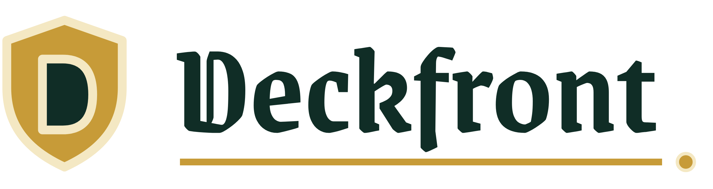

<p align="center">
  <picture>
    <source media="(prefers-color-scheme: dark)" srcset="assets/Deckfront-dark.png">
    
  </picture>
</p>

<p align="center">
  Build a deck. Control the distance. Take the other fighter to 0 health.
</p>

<div align="center">

[](https://deckfront.onrender.com)
[](https://discord.gg/B4dYUH7vj)


</div>

## What is Deckfront?

Deckfront is a two-player deck-building combat game. Play against an AI opponent or share one computer for a local match.

Like other deck-building games, Deckfront starts each player with a weak deck. Bought cards go into the discard pile and enter the deck on a later shuffle. Deckfront adds a six-space battlefield: the cards in your hand determine what you can do, but the distance between the fighters determines which attacks can connect.

The strongest Dominion influence is the market. Ten variable cards define each game. Copper, Silver, Gold, Step, Focus, and Scrap are always available. Cards can draw more cards, remove weak cards by trashing them, move the fighters, and attack at different ranges.

Both players buy from the same 16 market piles: 6 fixed cards and 10 cards selected from a pool of 40. Deckfront has 46 unique cards.

The initial public playtest chooses from [160 fixed markets selected for broad card and interaction coverage](docs/representative-markets.md). Each one has AI strategies computed in advance. It does not yet generate a new market from all 847,660,528 possible ten-card combinations.

## How a match works

The first player starts at 46 health and the second player starts at 50. Reduce the other fighter to 0 health to win.

A turn has two phases:

1. Play as many Action cards as you want and can legally use.
2. End the Action phase to play Treasures, then buy as many cards as your money allows.

Bought cards enter your discard pile. When your deck runs out, the discard pile becomes a new shuffled deck, so each purchase changes later hands rather than the current one.

Position creates three ranges:

- **Close:** both fighters are on the same space; Melee attacks work here.
- **Near:** the fighters are one space apart.
- **Far:** the fighters are two or more spaces apart.
- **Ranged attacks:** work at Near or Far range unless a card says otherwise.
- **Mana attacks:** work at any range, but require mana to build and spend.

A standard deck starts with 7 Copper and 3 Scrap. Scrap costs 1 and has a 10-card fixed market pile, but card effects cannot gain it. Local matches can instead use a starting draft: before the first turn, each player spends up to 12 money on cards from the current market, then shuffles those cards with 7 Copper to form a stronger opening deck. Up to 3 unspent draft money carries into the first Buy phase. Starting with useful cards makes draft games faster.

AI matches offer four difficulty levels and let either the player or the AI move first.

<!--
## Origins and design goals
-->

## AI opponents and balance work

Deckfront's AI work was inspired by Matt Fisher's [Provincial AI for Dominion](https://graphics.stanford.edu/~mdfisher/DominionAI.html). Provincial searched for a separate purchase plan for each ten-card kingdom and represented that plan as a short, ordered list a person could inspect. That made the result useful for understanding a kingdom, not only for beating an opponent.

Deckfront keeps that constraint. The goal was not to build the strongest possible black-box player. The goal was to build strategies that are:

- **Interpretable:** a strategy is an ordered purchase plan rather than an opaque model.
- **Repeatable:** rerunning the search on the same market should recover the same strategies, card choices, or behaviorally equivalent plans.
- **Scalable:** the same search process can cover many markets quickly enough to support repeated card changes.

The browser opponent combines a saved purchase plan with one shared tactical policy for playing cards and moving on the battlefield. Easy, Normal, Hard, and Expert select different saved plans. The current website chooses one of the 160 covered markets and loads its saved strategies; opening a game does not start a training job.

For balance work, repeatability means more than finding an opponent with a similar win rate. A fresh run on the same market needs to recover the same cards and strategy families, or plans that behave the same in real games. If two runs reach similar strength through unrelated cards, their card-usage results are not stable enough to guide balance changes.

The same simulation system was used to balance the cards across the [160 selected markets](docs/representative-markets.md). Repeated search and card changes made Melee, Ranged, and Mage strategies competitive and made each card worth buying in at least some strategies. Some cards are still stronger than others, but very few, if any, should go unbought across the full set of markets.

A future version will generate markets outside the fixed 160 and train a matching opponent during setup.

## Current version

Deckfront is in its initial public playtest.

Available now:

- One player against an AI opponent.
- Two local players sharing one computer.
- Four AI difficulty levels.
- 46 card types and 160 selected markets.
- Optional starting drafts for local games.
- Persistent game saves and multi-step undo.

Coming soon:

- Online multiplayer.
- Player accounts, profiles, or public statistics.
- On-demand AI training for arbitrary new markets.
- Mobile layouts. The table supports desktop screens from 1280×720 through 1920×1080.

## Development

Deckfront uses TypeScript, React, Node.js, and Rust. The TypeScript game engine is deterministic and shared by the server, browser views, tests, and simulation adapters. Rust runs the high-volume strategy search used for AI and balance work.

Requires Node.js 22 or later and npm:

```sh
npm install
npm run dev
```

Open `http://127.0.0.1:4173`. The local server stores games in `.data/games` by default.

The main code boundaries are:

```text
src/game-data/   Cards and market definitions
src/game/        Deterministic rules, state, commands, and replay
src/client/      React game table
src/server/      HTTP routes, AI opponent, and file persistence
src/sim/         Strategy search, balance analysis, and native adapters
rust/            High-volume native simulation and search
scripts/         Reports, operator commands, and verification tools
test/            Vitest and Playwright behavior tests
```

Run the normal checks with:

```sh
npm test
npm run typecheck
npm run lint
npm run build
```

Native simulation, Modal operators, and browser behavior have additional checks:

```sh
npm run verify:native
npm run modal:test
npm run test:e2e
```

Production uses the root Dockerfile and `render.yaml`. The Render service stores saved games on a persistent disk.

## Technical documentation

- [Why the public playtest uses 160 representative markets](docs/representative-markets.md)
- [How strategy search works](docs/strategy-search-process.md)
- [How to interpret strategy-search and balance evidence](docs/strategy-search-evidence.md)
- [Goldfish Modal operator guide](docs/strategy-search-goldfish-modal.md)
- [PSRO Modal operator guide](docs/strategy-search-psro-modal.md)
